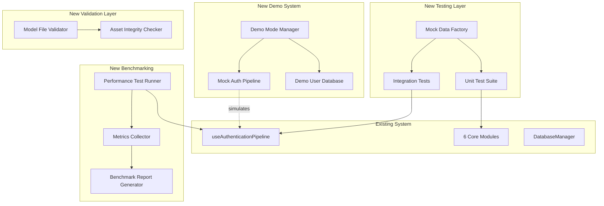

# Design Document: Hackathon Completion Suite

## Overview

The Hackathon Completion Suite addresses five critical gaps in the NHAI FaceAuth submission that could prevent winning: comprehensive unit testing infrastructure, demo mode with mock authentication flows, integration test suite, model file validation system, and performance benchmarking framework. This design ensures all hackathon judging criteria (Innovation 30pts, Feasibility 30pts, Scalability 20pts, Presentation 20pts) are demonstrably met through systematic testing and validation.

The design follows the existing React Native TypeScript architecture with Jest testing framework, maintains the offline-first design principle, and ensures zero disruption to production authentication flows while enabling comprehensive demo capabilities for presentation.

## Architecture



## Components and Interfaces

### Component 1: Unit Test Suite

**Purpose**: Provide comprehensive test coverage for all 6 core modules meeting hackathon requirements

**Interface**:
```typescript
// Test structure for each module
interface ModuleTestSuite {
  // Test initialization and cleanup
  beforeAll: () => Promise<void>;
  afterAll: () => Promise<void>;
  
  // Core functionality tests
  testInitialization: () => void;
  testCoreOperations: () => void;
  testErrorHandling: () => void;
  testEdgeCases: () => void;
  
  // Performance tests
  testPerformanceBaseline: () => void;
}

// Mock data generator for testing
interface TestDataFactory {
  generateMockFrame(width: number, height: number): Float32Array;
  generateMockFaceDetection(): FaceDetectionResult;
  generateMockLandmarks(): FaceLandmark[];
  generateMockEmbedding(): Float32Array;
  generateMockUser(): EnrolledUser;
  generateMockAuthLog(): AuthLog;
}
```

**Responsibilities**:
- Test all 6 modules independently with mocked dependencies
- Achieve minimum 80% code coverage across all modules
- Validate error handling for invalid inputs and edge cases
- Test performance baselines (detection <10ms, recognition <20ms)
- Mock TFLite model inference to avoid loading actual models in unit tests
- Validate data transformations and preprocessing logic
- Test SQLite database operations with in-memory databases

**Test Organization**:
```
NHAIFaceAuth/
  __tests__/
    modules/
      faceDetection/
        FaceDetector.test.ts
        FaceValidator.test.ts
      livenessDetection/
        ActiveChallenge.test.ts
        PassiveAntiSpoof.test.ts
        ChallengeManager.test.ts
        AdaptiveThreshold.test.ts
      faceRecognition/
        FaceRecognizer.test.ts
        FacePreprocessor.test.ts
        FaceMatcher.test.ts
        EnrollmentManager.test.ts
      dataManager/
        DatabaseManager.test.ts
        KeyManager.test.ts
        LockoutManager.test.ts
        StorageMonitor.test.ts
      syncService/
        SyncManager.test.ts
        S3Uploader.test.ts
        PurgeManager.test.ts
    utils/
      helpers.test.ts
    hooks/
      useAuthenticationPipeline.test.ts
```

### Component 2: Demo Mode System

**Purpose**: Enable presentation-ready authentication demonstrations without requiring actual models or camera, critical for hackathon judging

**Interface**:
```typescript
interface DemoModeConfig {
  enabled: boolean;
  demoScenario: 'success' | 'failure' | 'spoof' | 'custom';
  simulatedLatency: number; // milliseconds
  mockUsers: DemoUser[];
  autoProgress: boolean;
}

interface DemoModeManager {
  // Enable/disable demo mode
  setDemoMode(enabled: boolean): void;
  isDemoMode(): boolean;
  
  // Load demo scenario
  loadScenario(scenario: DemoScenario): void;
  
  // Simulate authentication flow
  simulateAuthentication(): Promise<AuthenticationResult>;
  
  // Get demo user database
  getDemoUsers(): DemoUser[];
  
  // Simulate specific failures for demonstration
  simulateFailure(reason: FailureReason): Promise<AuthenticationResult>;
}

interface DemoUser {
  id: string;
  name: string;
  role: string;
  photo: string; // base64 or asset path
  embedding: Float32Array; // pre-generated
  enrollmentDate: string;
}

interface DemoScenario {
  name: string;
  description: string;
  steps: DemoStep[];
  expectedOutcome: 'success' | 'failure';
}

interface DemoStep {
  stage: PipelineState;
  duration: number; // milliseconds
  message: string;
  visualFeedback: 'green' | 'yellow' | 'red';
}
```

**Responsibilities**:
- Provide realistic authentication simulation without camera/models
- Support multiple demo scenarios (success, liveness failure, spoof detection, no match)
- Maintain 5-7 realistic demo users with photos and metadata
- Simulate timing that matches real pipeline (<1 second total)
- Enable toggling demo mode from AdminDashboard settings
- Progress through pipeline states with realistic delays
- Generate authentic-looking GPS coordinates and device metadata
- Log demo authentications to separate demo database table

**Demo Scenarios**:
1. **Success Flow**: Face detected → Liveness passed → Match found → Welcome user
2. **Liveness Failure**: Face detected → Blink challenge failed → Access denied
3. **Spoof Detection**: Face detected → Liveness passed → Spoof detected → Access denied
4. **No Match**: Face detected → Liveness passed → Face not in database → Access denied
5. **Multiple Faces**: Multiple faces detected → Access denied

### Component 3: Integration Test Suite

**Purpose**: Validate end-to-end pipeline flows and inter-module communication

**Interface**:
```typescript
interface IntegrationTestSuite {
  // Full pipeline tests
  testSuccessfulAuthenticationFlow(): Promise<void>;
  testFailedAuthenticationFlow(): Promise<void>;
  testEnrollmentFlow(): Promise<void>;
  testSyncFlow(): Promise<void>;
  
  // Database integration
  testDatabasePersistence(): Promise<void>;
  testEncryptionIntegrity(): Promise<void>;
  
  // Sync integration
  testS3UploadFlow(): Promise<void>;
  testPurgeFlow(): Promise<void>;
  
  // Lockout integration
  testLockoutTrigger(): Promise<void>;
  testLockoutRecovery(): Promise<void>;
}

interface E2ETestContext {
  setupTestEnvironment(): Promise<void>;
  cleanupTestEnvironment(): Promise<void>;
  mockCameraFrames(): AsyncGenerator<Float32Array>;
  mockNetworkConnectivity(online: boolean): void;
  assertDatabaseState(expectedState: any): Promise<void>;
  assertUIState(expectedState: any): void;
}
```

**Responsibilities**:
- Test complete authentication flow from camera to database
- Validate enrollment flow with 5-photo capture simulation
- Test sync flow with mocked S3 endpoints
- Validate lockout mechanism with repeated failures
- Test database encryption and decryption flow
- Verify GPS logging and metadata collection
- Test offline-to-online transition scenarios
- Validate purge logic for old records

**Test Organization**:
```
NHAIFaceAuth/
  __tests__/
    integration/
      authentication.e2e.test.ts
      enrollment.e2e.test.ts
      sync.e2e.test.ts
      lockout.e2e.test.ts
      database.e2e.test.ts
```

### Component 4: Model File Validator

**Purpose**: Ensure all required TFLite models exist, have correct sizes, and can be loaded successfully

**Interface**:
```typescript
interface ModelSpec {
  name: string;
  path: string;
  expectedSize: number; // bytes
  maxSize: number; // bytes
  quantization: 'INT8' | 'FLOAT32';
  inputShape: number[];
  outputShape: number[];
}

interface ModelValidator {
  // Validate all models exist and meet specs
  validateAllModels(): Promise<ValidationReport>;
  
  // Validate individual model
  validateModel(spec: ModelSpec): Promise<ModelValidationResult>;
  
  // Check total model bundle size
  getTotalModelSize(): Promise<number>;
  
  // Verify model can be loaded by TFLite runtime
  testModelLoading(modelPath: string): Promise<boolean>;
}

interface ValidationReport {
  allValid: boolean;
  totalSize: number;
  models: ModelValidationResult[];
  errors: string[];
  warnings: string[];
}

interface ModelValidationResult {
  modelName: string;
  exists: boolean;
  actualSize: number;
  withinSizeLimit: boolean;
  loadable: boolean;
  errors: string[];
}
```

**Responsibilities**:
- Verify all 4 TFLite models exist in assets/models/ directory
- Check file sizes match specifications (total ≤ 7.2MB)
- Validate INT8 quantization format
- Attempt to load each model with TFLite runtime
- Report missing or corrupted model files
- Validate input/output tensor shapes
- Generate validation report for pre-submission checklist

**Model Specifications**:
```typescript
const MODEL_SPECS: ModelSpec[] = [
  {
    name: 'BlazeFace',
    path: 'assets/models/blazeface.tflite',
    expectedSize: 200 * 1024, // 200KB
    maxSize: 250 * 1024,
    quantization: 'INT8',
    inputShape: [1, 128, 128, 3],
    outputShape: [1, 896, 16], // 896 anchors
  },
  {
    name: 'FaceMesh',
    path: 'assets/models/facemesh.tflite',
    expectedSize: 2.5 * 1024 * 1024, // 2.5MB
    maxSize: 3 * 1024 * 1024,
    quantization: 'INT8',
    inputShape: [1, 192, 192, 3],
    outputShape: [1, 468, 3], // 468 landmarks
  },
  {
    name: 'MobileNetV2 AntiSpoof',
    path: 'assets/models/antispoof.tflite',
    expectedSize: 3.5 * 1024 * 1024, // 3.5MB
    maxSize: 4 * 1024 * 1024,
    quantization: 'INT8',
    inputShape: [1, 224, 224, 3],
    outputShape: [1, 2], // [spoof_prob, real_prob]
  },
  {
    name: 'MobileFaceNet',
    path: 'assets/models/mobilefacenet.tflite',
    expectedSize: 1.0 * 1024 * 1024, // 1.0MB
    maxSize: 1.5 * 1024 * 1024,
    quantization: 'INT8',
    inputShape: [1, 112, 112, 3],
    outputShape: [1, 128], // 128D embedding
  },
];
```

### Component 5: Performance Benchmarking Framework

**Purpose**: Measure and report actual device performance to prove <1 second requirement for feasibility scoring

**Interface**:
```typescript
interface BenchmarkConfig {
  device: DeviceInfo;
  iterations: number;
  warmupIterations: number;
  testScenarios: BenchmarkScenario[];
}

interface BenchmarkRunner {
  // Run full benchmark suite
  runBenchmarks(config: BenchmarkConfig): Promise<BenchmarkReport>;
  
  // Benchmark individual components
  benchmarkFaceDetection(iterations: number): Promise<ComponentMetrics>;
  benchmarkLivenessCheck(iterations: number): Promise<ComponentMetrics>;
  benchmarkFaceRecognition(iterations: number): Promise<ComponentMetrics>;
  benchmarkFullPipeline(iterations: number): Promise<PipelineMetrics>;
  
  // Memory profiling
  profileMemoryUsage(): Promise<MemoryProfile>;
  
  // Generate report
  generateReport(results: BenchmarkResults): BenchmarkReport;
}

interface ComponentMetrics {
  componentName: string;
  meanLatency: number; // ms
  stdDeviation: number;
  p50Latency: number;
  p95Latency: number;
  p99Latency: number;
  minLatency: number;
  maxLatency: number;
  iterations: number;
}

interface PipelineMetrics {
  totalLatency: number; // ms
  stages: {
    detection: number;
    validation: number;
    liveness: number;
    recognition: number;
  };
  meetsRequirement: boolean; // < 1000ms
}

interface MemoryProfile {
  peakMemoryMB: number;
  avgMemoryMB: number;
  modelMemoryMB: number;
  bufferMemoryMB: number;
}

interface BenchmarkReport {
  deviceInfo: DeviceInfo;
  timestamp: string;
  summary: {
    passedRequirements: boolean;
    totalPipelineLatency: number;
    breakdown: PipelineMetrics;
  };
  components: ComponentMetrics[];
  memory: MemoryProfile;
  recommendations: string[];
}

interface DeviceInfo {
  model: string;
  manufacturer: string;
  osVersion: string;
  cpuArchitecture: string;
  totalMemoryMB: number;
  availableMemoryMB: number;
}
```

**Responsibilities**:
- Measure actual latency on target devices (Redmi Note 10, Samsung A32, etc.)
- Break down latency by pipeline stage
- Collect percentile metrics (p50, p95, p99)
- Profile memory usage during authentication
- Generate formatted report for presentation slides
- Test under various conditions (good light, poor light, various angles)
- Validate <1 second total pipeline requirement
- Compare against hackathon benchmarks

**Benchmark Scenarios**:
1. **Optimal Conditions**: Good lighting, frontal face, no glasses
2. **Challenging Lighting**: Low light (< 50 lux), high contrast
3. **Accessories**: Glasses, hats, face masks (partial)
4. **Angles**: 15°, 30°, 45° face rotation
5. **Distance**: Near (20cm), optimal (40cm), far (60cm)

## Data Models

### Model 1: Test Mock Data

```typescript
interface MockFaceFrame {
  pixels: Float32Array;
  width: number;
  height: number;
  format: 'RGB' | 'RGBA' | 'YUV';
  timestamp: number;
}

interface MockFaceDetectionResult {
  detected: boolean;
  boundingBox: BoundingBox;
  keypoints: FaceLandmark[];
  confidence: number;
}

interface MockAuthLog {
  id: string;
  timestamp: string;
  userId: string | null;
  result: 'success' | 'failure';
  matchConfidence: number;
  livenessScore: number;
  antiSpoofScore: number;
  processingTimeMs: number;
  deviceId: string;
  synced: boolean;
}
```

**Validation Rules**:
- pixels.length === width * height * channels
- confidence in [0, 1]
- boundingBox coordinates within frame bounds
- timestamp is valid UTC ISO string

### Model 2: Demo Configuration

```typescript
interface DemoConfig {
  enabled: boolean;
  scenario: DemoScenario;
  users: DemoUser[];
  settings: {
    simulatedLatency: number;
    autoProgress: boolean;
    showDebugInfo: boolean;
    mockGPS: { latitude: number; longitude: number };
  };
  persistLogs: boolean;
}
```

**Validation Rules**:
- simulatedLatency >= 0 and <= 5000ms
- users.length >= 3
- mockGPS latitude in [-90, 90]
- mockGPS longitude in [-180, 180]

### Model 3: Benchmark Results

```typescript
interface BenchmarkResults {
  testId: string;
  timestamp: string;
  device: DeviceInfo;
  results: {
    faceDetection: ComponentMetrics;
    liveness: ComponentMetrics;
    recognition: ComponentMetrics;
    fullPipeline: PipelineMetrics;
  };
  memory: MemoryProfile;
  conditions: TestConditions;
}

interface TestConditions {
  lighting: 'optimal' | 'low' | 'high';
  angle: number; // degrees
  accessories: string[];
  distance: number; // cm
}
```

**Validation Rules**:
- All latency values > 0
- fullPipeline.totalLatency === sum of stage latencies (±5% tolerance)
- memory values > 0
- angle in [0, 360]

## Error Handling

### Error Scenario 1: Missing Model Files

**Condition**: TFLite model files not found in assets/models/ directory
**Response**: 
- ModelValidator returns validation report with errors
- Provide clear error message indicating which models are missing
- Display expected file paths
- Prevent app initialization until models are present
**Recovery**: 
- Download models from model_pipeline/ output
- Place in correct assets/models/ directory
- Re-run validation

### Error Scenario 2: Model Loading Failure

**Condition**: TFLite model exists but fails to load (corrupted, wrong format)
**Response**:
- Catch TFLite initialization error
- Log detailed error message with model name
- Display user-friendly error in UI
- Mark model as invalid in validation report
**Recovery**:
- Re-export model using model_pipeline scripts
- Verify INT8 quantization format
- Check model file integrity (MD5 hash)

### Error Scenario 3: Test Failures

**Condition**: Unit or integration tests fail during CI/CD or local development
**Response**:
- Jest reports detailed failure message with stack trace
- Mock data factory provides reproducible test inputs
- Isolate failing module/function
- Check for breaking changes in dependencies
**Recovery**:
- Fix code to pass test assertions
- Update tests if requirements changed
- Verify mock data matches production data formats

### Error Scenario 4: Performance Benchmark Below Threshold

**Condition**: Device latency exceeds 1 second requirement
**Response**:
- Benchmark report highlights failing components
- Provide breakdown of which stage is slow
- Display percentile distribution
- Compare against target device baselines
**Recovery**:
- Profile specific slow components
- Optimize tensor operations
- Reduce model input sizes if possible
- Test on different device to isolate hardware issues

### Error Scenario 5: Demo Mode Not Persisting

**Condition**: Demo mode toggle doesn't persist across app restarts
**Response**:
- Check AsyncStorage write success
- Verify config serialization
- Log error if storage write fails
**Recovery**:
- Clear AsyncStorage and retry
- Use fallback to in-memory config
- Display warning to user about demo mode reset

## Testing Strategy

### Unit Testing Approach

Use Jest with React Native preset to test all modules in isolation. Mock external dependencies (TFLite models, SQLite, camera, S3) to focus on business logic. Target 80% code coverage minimum across all modules.

**Key Test Categories**:
- **Initialization Tests**: Verify modules initialize correctly with valid config
- **Core Logic Tests**: Test detection algorithms, validation rules, matching logic
- **Error Handling Tests**: Inject invalid inputs, null values, out-of-range parameters
- **Edge Case Tests**: Test boundary conditions (empty arrays, zero values, maximum sizes)
- **Performance Tests**: Verify functions complete within expected time bounds

**Mocking Strategy**:
- Mock TFLite inference with pre-generated output tensors
- Mock SQLite with in-memory database (`:memory:`)
- Mock camera frames with synthetic Float32Array data
- Mock S3 SDK with jest.mock() and test implementations
- Mock NetInfo for connectivity testing

**Example Test Structure**:
```typescript
describe('FaceDetector', () => {
  let detector: FaceDetector;
  
  beforeAll(async () => {
    // Mock TFLite model loading
    jest.mock('react-native-fast-tflite');
    detector = new FaceDetector();
    await detector.initialize();
  });
  
  afterAll(() => {
    detector.dispose();
  });
  
  it('should detect face in valid frame', () => {
    const frame = TestDataFactory.generateMockFrame(640, 480);
    const result = detector.detectFace(frame, 640, 480);
    expect(result.detected).toBe(true);
    expect(result.confidence).toBeGreaterThan(0.8);
  });
  
  it('should handle empty frame', () => {
    const frame = new Float32Array(640 * 480 * 3);
    const result = detector.detectFace(frame, 640, 480);
    expect(result.detected).toBe(false);
  });
});
```

### Property-Based Testing Approach

Not applicable for this hackathon completion suite. Focus is on deterministic unit and integration tests rather than generative property testing.

### Integration Testing Approach

Use Jest with async/await for end-to-end pipeline testing. Set up test environment with in-memory database, mocked models, and simulated camera frames. Verify data flows correctly through all pipeline stages.

**Key Integration Tests**:
1. **Full Authentication Flow**: Camera → Detection → Liveness → Recognition → Database
2. **Enrollment Flow**: Capture 5 photos → Generate embedding → Store in database
3. **Sync Flow**: Generate logs → Detect connectivity → Upload to S3 → Purge old logs
4. **Lockout Flow**: Trigger 3 failures → Verify lockout → Wait timeout → Retry success
5. **Database Encryption**: Write encrypted data → Close DB → Reopen → Decrypt and read

**Test Isolation**:
- Each test uses fresh database instance
- Clean up resources after each test
- No shared state between tests
- Deterministic test execution order

## Performance Considerations

**Target Metrics**:
- Total pipeline latency: < 1000ms (1 second) on Redmi Note 10 class devices
- Face detection: < 10ms
- Liveness check: < 30ms (active + passive combined)
- Face recognition: < 20ms
- Database operations: < 5ms

**Optimization Strategies**:
- Run tests in parallel where possible (Jest --maxWorkers)
- Use in-memory database for unit tests (faster than disk)
- Cache mock data generation results
- Skip model loading in most unit tests (mock outputs directly)
- Profile slow tests and optimize

**Benchmarking Performance**:
- Run benchmarks on actual target devices, not emulators
- Warm up models before measuring (first inference is slower)
- Measure across 100+ iterations for statistical significance
- Report percentiles (p50, p95, p99) not just mean
- Test under various device states (cold start, background apps running)

## Security Considerations

**Test Data Security**:
- Do not commit real user photos or biometric data to repository
- Use synthetic face images or public datasets for testing
- Generate random embeddings for mock users
- Encrypt test databases with test-only encryption keys
- Clear test data after test suite completion

**Demo Mode Security**:
- Demo mode should be clearly indicated in UI (banner, watermark)
- Demo authentication logs stored in separate table, not mixed with real logs
- Demo mode disabled by default in production builds
- Require admin password to enable demo mode in production
- Demo embeddings should not match real users

**S3 Mock Security**:
- Use IAM roles with minimum required permissions for test S3 bucket
- Test S3 bucket should be separate from production
- Implement bucket lifecycle policies to auto-delete test uploads
- Do not expose S3 credentials in test code (use environment variables)

## Dependencies

**Testing Dependencies** (already in package.json):
- `jest`: ^29.7.0 (test runner)
- `@types/jest`: Type definitions for Jest

**Additional Development Dependencies Needed**:
- `@testing-library/react-native`: Testing utilities for React Native components
- `@testing-library/jest-native`: Custom Jest matchers for React Native
- `jest-expo`: Jest preset for Expo projects (if using Expo)
- `ts-jest`: TypeScript preprocessor for Jest

**Runtime Dependencies** (for demo mode):
- `@react-native-async-storage/async-storage`: Already included (store demo config)
- No additional dependencies needed

**Model Files** (must be placed in assets/models/):
- `blazeface.tflite` (200KB)
- `facemesh.tflite` (2.5MB)
- `antispoof.tflite` (3.5MB)
- `mobilefacenet.tflite` (1.0MB)

**Testing Assets**:
- Synthetic face images for testing (can be generated or downloaded from public datasets)
- Test user photos for demo mode (5-7 stock photos)
- Test TFLite model stubs (minimal models for loading tests)

## Correctness Properties

*A property is a characteristic or behavior that should hold true across all valid executions of a system—essentially, a formal statement about what the system should do. Properties serve as the bridge between human-readable specifications and machine-verifiable correctness guarantees.*

### Property 1: Test Coverage Threshold

*For any* execution of the complete test suite, the code coverage report must show at least 80% coverage across all modules.

**Validates: Requirement 1.2**

### Property 2: Face Detection Test Performance

*For any* face detection test operation, the execution time must be under 10ms.

**Validates: Requirement 1.4**

### Property 3: Face Recognition Test Performance

*For any* face recognition test operation, the execution time must be under 20ms.

**Validates: Requirement 1.5**

### Property 4: Mock Data Type Compatibility

*For any* mock data generated by Mock_Factory, the output data structure must match production data type signatures exactly.

**Validates: Requirement 1.6**

### Property 5: Test File Naming Convention

*For any* test file created for a class, the filename must follow the pattern {ClassName}.test.ts.

**Validates: Requirement 2.5**

### Property 6: Demo Mode Toggle Consistency

*For any* sequence of demo mode operations, calling setDemoMode(true) followed by isDemoMode() returns true, and calling setDemoMode(false) followed by isDemoMode() returns false.

**Validates: Requirement 3.1**

### Property 7: Demo Mode Independence

*For any* authentication simulation in demo mode, the system must complete without requiring camera hardware or TFLite model files.

**Validates: Requirement 3.2**

### Property 8: Demo Authentication Timing

*For any* demo authentication simulation, the total execution time must be under 1000ms with realistic stage timing.

**Validates: Requirement 3.4**

### Property 9: Demo Log Isolation

*For any* authentication performed in demo mode, the log entry must be written to the demo database table and not mixed with production authentication logs.

**Validates: Requirements 3.6, 17.6, 18.5**

### Property 10: Demo GPS Coordinate Validity

*For any* GPS coordinates generated by Demo_Mode_Manager, latitude must be in range [-90, 90] and longitude must be in range [-180, 180].

**Validates: Requirements 3.7, 11.5**

### Property 11: Demo Mode Pipeline Switching

*For any* system state, when demo mode is disabled, the system must use the production authentication pipeline for all subsequent authentications.

**Validates: Requirement 3.8**

### Property 12: Demo Configuration Persistence

*For any* demo mode configuration, storing to AsyncStorage then restarting the app and loading must restore the exact configuration including demo mode state, scenario selection, and latency settings.

**Validates: Requirements 4.1, 4.2, 4.3, 4.4**

### Property 13: Model File Existence

*For all* 4 TFLite models (BlazeFace, FaceMesh, AntiSpoof, MobileFaceNet), the Model_Validator must verify each file exists in the assets/models/ directory.

**Validates: Requirement 6.1**

### Property 14: Total Model Bundle Size

*For any* validation run, the total size of all model files combined must be under 7.2MB.

**Validates: Requirement 6.6**

### Property 15: Model Loadability

*For any* model validated by Model_Validator, the system must successfully load it with the TFLite runtime without errors.

**Validates: Requirement 6.7**

### Property 16: Model Quantization Format

*For all* TFLite models, the Model_Validator must verify INT8 quantization format.

**Validates: Requirement 6.8**

### Property 17: Model Tensor Shape Validation

*For any* model validated by Model_Validator, the input and output tensor shapes must match the specifications defined for that model.

**Validates: Requirement 6.9**

### Property 18: Benchmark Iteration Count

*For any* benchmark execution, the Benchmark_Runner must execute a minimum of 100 iterations for statistical significance.

**Validates: Requirement 8.5**

### Property 19: Benchmark Metric Completeness

*For any* benchmark report, it must include mean, standard deviation, p50, p95, and p99 latencies for all measured components.

**Validates: Requirement 8.6**

### Property 20: Benchmark Device Information

*For any* benchmark run, the report must include device model, manufacturer, OS version, and CPU architecture.

**Validates: Requirement 8.7**

### Property 21: Benchmark Failure Detection

*For any* benchmark run where full pipeline latency exceeds 1000ms, the system must mark the benchmark as failed.

**Validates: Requirement 8.8**

### Property 22: Benchmark Condition Recording

*For any* benchmark measurement, the system must record the test conditions (lighting, angle, accessories, distance) alongside the measurement.

**Validates: Requirement 9.6**

### Property 23: Mock Frame Dimension Consistency

*For any* mock camera frame generated with specified width and height, the pixel array length must equal width × height × channels.

**Validates: Requirements 10.6, 11.1**

### Property 24: Mock Detection Result Structure

*For any* mock face detection result generated, it must include bounding box and landmarks fields.

**Validates: Requirement 10.2**

### Property 25: Mock Embedding Dimensionality

*For any* mock face embedding generated, it must be a Float32Array with exactly 128 dimensions.

**Validates: Requirement 10.3**

### Property 26: Mock User Data Completeness

*For any* mock enrolled user generated, it must include ID, name, and metadata fields.

**Validates: Requirement 10.4**

### Property 27: Mock Authentication Log Structure

*For any* mock authentication log generated, it must include timestamp and result fields.

**Validates: Requirement 10.5**

### Property 28: Mock Confidence Range

*For any* mock face detection result generated, the confidence value must be in the range [0, 1].

**Validates: Requirements 10.7, 11.2**

### Property 29: Mock Bounding Box Validity

*For any* mock bounding box generated for a frame, all coordinates must be within the frame bounds.

**Validates: Requirements 10.8, 11.3**

### Property 30: Timestamp Format Validity

*For any* generated timestamp, it must be a valid UTC ISO string format.

**Validates: Requirement 11.4**

### Property 31: Simulated Latency Range

*For any* demo configuration, the simulated latency value must be between 0 and 5000ms.

**Validates: Requirement 11.6**

### Property 32: Mock Data Reproducibility

*For any* mock data generation with the same seed, the Mock_Factory must produce identical output across multiple executions.

**Validates: Requirement 14.2**

### Property 33: Test Execution Consistency

*For any* test suite execution, running tests individually must produce the same results as running them in parallel with --maxWorkers=4.

**Validates: Requirement 16.1**

### Property 34: Test Database Encryption

*For any* test database created, it must be encrypted with test-only encryption keys.

**Validates: Requirement 17.4**

### Property 35: Demo Embedding Uniqueness

*For any* demo user embedding, it must not match any real user embeddings in the production database.

**Validates: Requirement 18.4**

### Property 36: Benchmark Report Completeness

*For any* benchmark report generated, it must include device information, timestamp, summary with pass/fail status, total pipeline latency with stage breakdown, component metrics with percentiles, memory profile, and optimization recommendations.

**Validates: Requirements 19.1, 19.2, 19.3, 19.4, 19.5, 19.6, 19.7**
