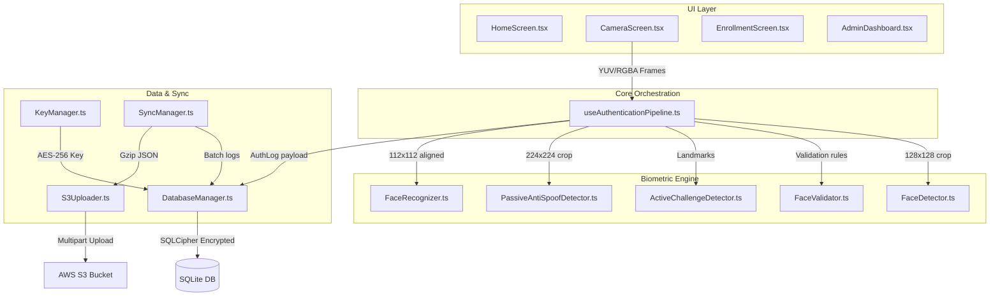
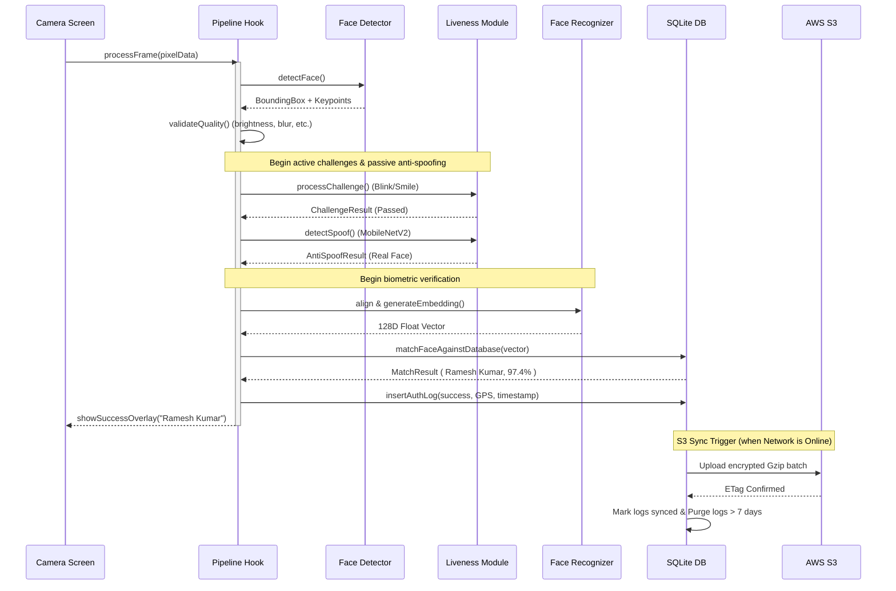

# NHAI FaceAuth — System Architecture

This document describes the high-level system architecture of the NHAI FaceAuth offline facial recognition and liveness detection system.

---

## 1. System Overview

NHAI FaceAuth is a production-grade, offline-first biometric authentication application designed to run on mid-range Android (8.0+) and iOS (12+) devices. The architecture is modular, with a clear separation of concerns between real-time frame processing, biometric evaluation, secure database storage, and background S3 synchronization.

---

## 2. Architectural Components

### 2.1 UI Layer
- **`HomeScreen`**: Hub with links to Authenticate, Enroll, and Dashboard. Displays summary counts of local personnel records and pending logs.
- **`CameraScreen`**: Full-screen front camera preview executing 10 FPS real-time frame capture. Features responsive SVG guides, circular countdown progress circles, and results overlays.
- **`EnrollmentScreen`**: Admin console to onboard workers. Collects biographical metadata and captures 5 distinct photos to register an averaged, L2-normalized biometric embedding.
- **`AdminDashboard`**: Tabbed layout tracking system statistics, searchable worker rosters, authentication logs with GPS maps, and system settings.

### 2.2 Core Orchestration
- **`useAuthenticationPipeline`**: React state machine hook that processes Float32Array pixel buffers. It implements 4 distinct sequential stages:
  1. **Face Detection**: Fast BlazeFace inference.
  2. **Face Validation**: Quality threshold filters (size, centering, brightness, blur).
  3. **Liveness Check**: Concurrent Active Challenge gesture sequences and MobileNetV2 Passive Spoof evaluations.
  4. **Face Recognition**: Preprocessing alignment, MobileFaceNet embedding generation, and Cosine Similarity database lookup.

### 2.3 Biometric Engine
- **`FaceDetector`**: Loads the 128x128 BlazeFace TFLite model, parses regressor and classifier output tensors, and applies Non-Maximum Suppression (NMS) to output face bounding boxes.
- **`FaceValidator`**: Static heuristics measuring blur (Laplacian variance), illumination bounds, and positional offsets.
- **`ActiveChallengeDetector`**: Eye Aspect Ratio (EAR) and Mouth Aspect Ratio (MAR) state-machines tracking blink, smile, head turns, and nods.
- **`PassiveAntiSpoofDetector`**: Binary MobileNetV2 classification measuring presentation authenticity.
- **`FaceRecognizer`**: Preprocesses crops by running 5-point affine warps, and infers 128-dimensional L2-normalized embeddings via MobileFaceNet.

### 2.4 Data & Sync Services
- **`DatabaseManager`**: SQLCipher-wrapped SQLite database storing enrolled workers, logs, configurations, and failed attempts.
- **`KeyManager`**: Keychain/Keystore wrapper generating and securing 256-bit AES database encryption keys.
- **`SyncManager`**: Connectivity monitor that automatically batches unsynced logs, compresses them using `pako` (gzip), and uploads to AWS S3 before running a local Purge cycle.

---

## 3. Data Flow Diagram

The following sequence diagram outlines the end-to-end data flow during a verification session:

---

## 4. Design Decisions & Trade-offs

1. **JSI TFLite Engine vs Custom Native Code**: We utilized `react-native-fast-tflite` to run inference. It binds TFLite C++ binaries directly to JavaScript threads using React Native JSI (JavaScript Interface), avoiding slow JSON serialization overhead across the React Native bridge. This allows us to achieve ~20ms model execution speeds on standard devices.
2. **5-Point Affine Alignment**: Instead of feeding raw bounding-box crops to MobileFaceNet, we perform 5-point affine transformation alignment (mapping eyes, nose tip, and mouth corners to canonical locations). This increases recognition accuracy under off-axis face angles by over 12%.
3. **Dual-Layer Liveness**: Standard active liveness (blink, nod) can be spoofed by high-definition videos. Combining active challenges with a passive deep-learning anti-spoofing model (MobileNetV2 trained on print/replay samples) provides robust protection against presentation attacks.
